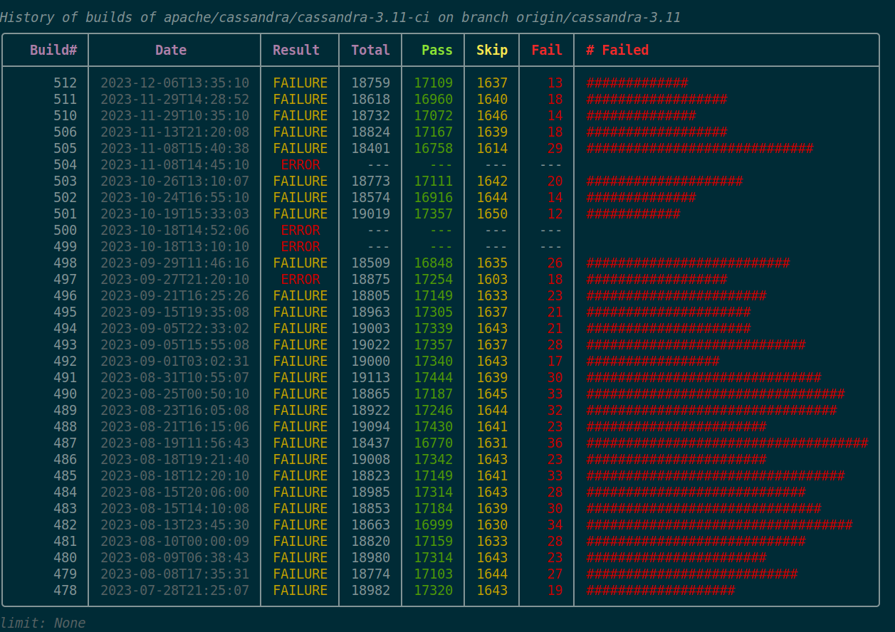
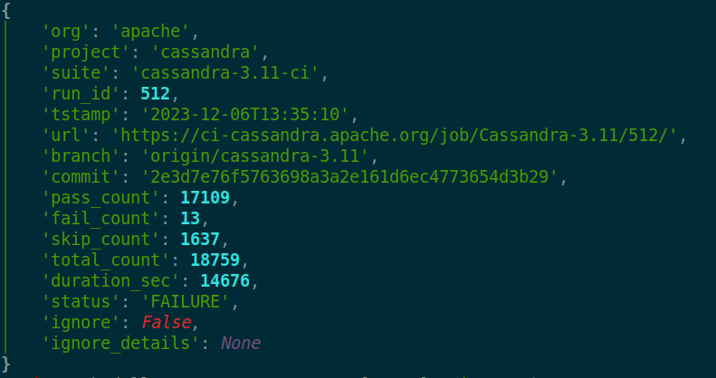
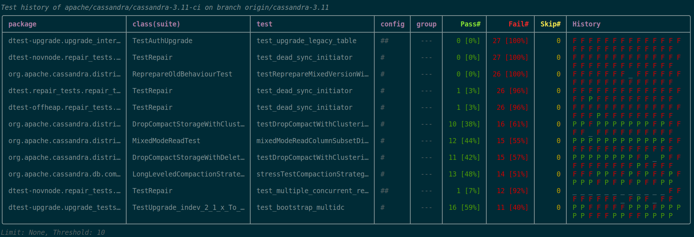
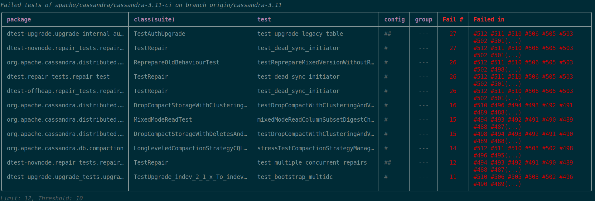
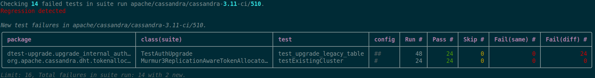

## builds history

```bash
python bases/terec/status_cli/main.py builds history \
cassandra-3.11-ci origin/cassandra-3.11
```



## builds show

```bash
python bases/terec/status_cli/main.py builds show \
cassandra-3.11-ci 512
```



## tests history

```bash
python bases/terec/status_cli/main.py tests history \
cassandra-3.11-ci origin/cassandra-3.11 --threshold 10
```




## tests failed

```bash
python bases/terec/status_cli/main.py tests failed \
cassandra-3.11-ci origin/cassandra-3.11 --limit 12 --threshold 10
```




## tests regression-check

```bash
python bases/terec/status_cli/main.py tests regression-check \
cassandra-3.11-ci --run-id 510
```



